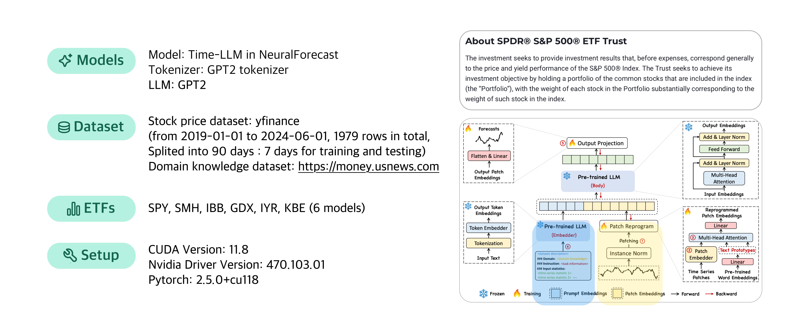

<h1 align='center' style="text-align:center; font-weight:bold; font-size:2.0em;letter-spacing:2.0px;"> TimeLLM4Stock: Stock Market Prediction with TimeLLM </h1>

> [!NOTE]
> This work is a project conducted as part of the Data Analysis course at Ewha Womans University.

## About llm-etf-prediction

Traditional sequence models, like RNNs and LSTMs, struggle to incorporate related data beyond time series for accurate forecasting. `Time-LLM` addresses this limitation by combining natural language-embedded domain knowledge with time series data, utilizing a pre-trained LLM for downstream tasks.

In this project, Time-LLM is applied to predict the closing prices of `Exchange Traded Funds (ETFs)`. By embedding sector-specific information about the ETFs, such as the industries they track or their inherent market characteristics, the model aims to improve predictive accuracy and make more reliable ETF close price forecasting.

## How to run
### 1) Prerequisites
To run this model, the following prerequisites are required:
- CUDA Version: 11.8
- Nvidia Driver Version: 470.103.01

```bash
conda create -n etf python=3.10.0
conda activate etf
conda install nvidia/label/cuda-11.8.0::cuda-toolkit
pip install torch==2.5.0+cu118 --extra-index-url https://download.pytorch.org/whl/cu118
pip install numpy==2.1.3
pip install neuralforecast
pip install transformers
pip install matplotlib
pip install ipywidgets
pip install yfinance
```

### 2) Clone
Clone this repository to your local computer using:
```bash
https://github.com/JeonHaeseung/llm-etf-prediction.git
```

### 3) Run
In the `time-llm.py` file, you can select your desired ETF to create the model.
```python
python3 time-llm.py
```

To check the result graph, you can run `result.py`.
```python
python3 result.py
```

## Dataset
Stock price datasets can be retrieved via API calls using Python's `yfinance` library. Natural language description data for the LLM is hard-coded in `time-llm.py`. If you want to fetch descriptions for a new stock, search for the stock ticker on `https://money.usnews.com` and use the description provided.

## 📈 Results
| Metric | IYR  | KBE  | SMH    | IBB  | SPY  | GDX  |
|--------|------|------|--------|------|------|------|
| MAE    | 0.99 | 0.66 | 25.23  | 4.58 | 6.96 | 2.93 |
| MSE    | 1.61 | 0.65 | 649.68| 21.77| 57.92| 11.15|
| MAPE   | 0.01 | 0.01 | 0.09   | 0.03 | 0.01 | 0.07 |

Time-LLM performed well with IYR and KBE, which follow relatively stable sectors. These ETFs exhibited the lowest error rates, likely due to their low variance and regular cycles, indicating that the model effectively utilized the domain knowledge provided. Conversely, SMH and GDX showed higher error rates, with SMH displaying the highest among all predictions. The results appear to stem from these sentiment-based judgments since sentiment analysis of the domain knowledge texts revealed instances where the tone was interpreted as positive or negative rather than completely neutral.
